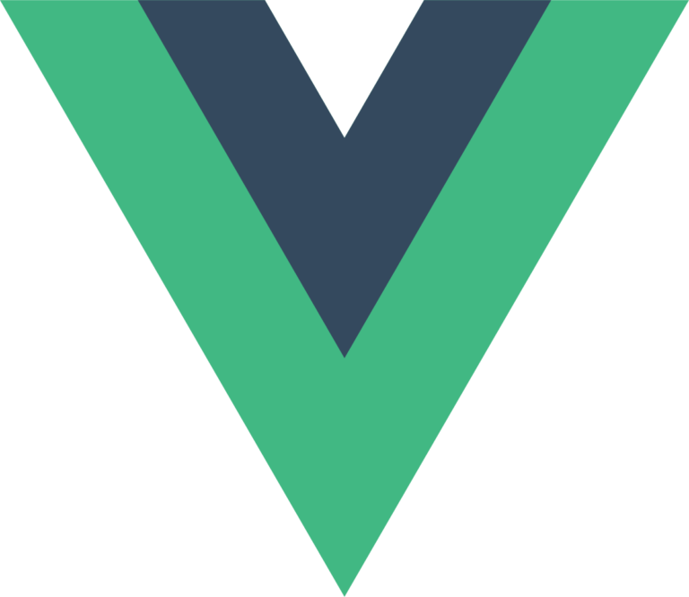

  

# Hi, I'm Edgar, a full stack web developer.

 

	I decided to get out of the mouse wheel I was running on endlessly, follow my passion and build my own path. That transition made me reconsider my goals, routine, habits and above all, the way I invest my time.

 

	My <a href="edgarparucho.github.io">portfolio</a> is ready and continuously improving. My biggest project until now has been Mantra. I'm currently working on some ideas to expand it.

	I’m always learning. Right now, i'm focused on mastering my core technical skills, especially JavaScript and the Vue JS ecosystem. 

 

# Skills

 

<table>
	<tr>
		<td width="60px">
			
		</td>
		<td width="70px">
			
		</td>
		<td width="80px">
			
		</td>
		<td width="90px">
			
		</td>
		<td width="63px">
			
		</td>
		<td width="63px">
			
		</td>
	</tr>
</table>

  

# Contact

 

<table>
  <tr>
    <td>
  		<a href="https://linkedin.com/in/parucho">
				 linkedin.com/in/edgarparucho
			</a>
		</td>
		<td>
  		<a href="mailto:parucho.edgar@outlook.es">
				 parucho.edgar@outlook.es
			</a>
		</td>
	</tr>
</table>
